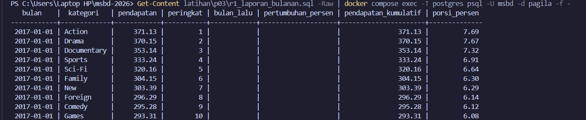

# Laporan Latihan Kelompok Pertemuan 3

## Anggota

| Nama                       | NIM       |
| -------------------------- | --------- |
| Jelita Hati Sinurat        | 251402141 |
| M. Dzakwan Ismail Rangkuti | 251402014 |
| Agi Aginta Sembiring       | 251402059 |
| M. Azkha Amorie            | 251402092 |
| Syifa Nazira               | 251402126 |

## Refleksi A - Subquery

**1. Pada Q4, apa tepatnya yang membuat `NOT IN` berbahaya, dan bagaimana memeriksa apakah sebuah kolom rawan terhadap masalah itu?**

`NOT IN` bisa berbahaya kalau subquery di dalamnya ternyata bisa menghasilkan nilai NULL. Soalnya `kolom NOT IN (SELECT x FROM t)` itu di baliknya sama aja kayak `kolom <> v1 AND kolom <> v2 AND ...` buat tiap nilai v yang dihasilkan subquery. Masalahnya, bandingin apa pun sama NULL (`<> NULL`) hasilnya bukan TRUE atau FALSE, tapi UNKNOWN — dan karena semua kondisi itu digabung pakai AND, cukup satu aja NULL nyelip di daftar hasil subquery, seluruh `NOT IN`-nya jadi UNKNOWN buat setiap baris. Akibatnya query bisa balikin nol baris sama sekali, padahal harusnya ada yang cocok.

Di Q4 kami, kolom yang dipakai di subquery adalah `inventory.film_id`, yang di skema Pagila memang `NOT NULL`, jadi versi `NOT IN` di sini aman-aman aja dan hasilnya sama persis kayak `NOT EXISTS` (sama-sama 42 baris). Buat ngecek kolom lain rawan atau nggak, caranya: cek dulu constraint-nya lewat `\d nama_tabel` di psql, kalau nggak ada `NOT NULL` di situ, jalanin `SELECT count(*) FROM tabel WHERE kolom IS NULL;` buat mastiin datanya bener-bener bersih dari NULL. Tapi paling aman sih emang jadiin kebiasaan: tambahin `WHERE kolom IS NOT NULL` di subquery-nya `NOT IN`, atau langsung pakai `NOT EXISTS` aja karena dia nggak kepengaruh NULL sama sekali — dia kerja berdasarkan ada/nggaknya baris yang cocok, bukan bandingin nilai satu-satu.

**2. Pada Q5, berapa kali subquery dievaluasi secara konseptual, dan mengapa "sekali per baris luar" belum tentu sama dengan yang benar-benar dikerjakan mesin?**

Q5 pakai subquery berkorelasi dengan `MAX(f2.rental_rate)` yang disaring `WHERE i2.store_id = i.store_id`, buat nyari tarif tertinggi per toko. Kalau dibayangin secara konsep, subquery ini kayak dihitung ulang satu kali buat tiap baris di query luar, soalnya dia nyambung ke `store_id` dari baris luar — jadi model sederhananya, subquery "dijalanin" sebanyak baris hasil join `film`-`inventory` yang lagi diperiksa (ribuan kali kalau dibayangin naif).

Tapi kenyataannya di eksekusi asli, nggak sesederhana itu. Hasil Q5 kami nunjukin 500 baris kesebar di 2 toko (`store_id` 1 dan 2), dan semuanya tarifnya 4.99 — nilai tertinggi dari cuma 3 kemungkinan tarif yang ada di Pagila (0.99, 2.99, 4.99). Karena nilai `rental_rate` variasinya dikit banget, PostgreSQL nggak perlu literally ngitung ulang `MAX` satu-satu per baris; query planner-nya bisa ngenalin pola subquery berkorelasi ini terus diubah jadi bentuk join/agregasi yang lebih optimal (misalnya, ngitung `MAX(rental_rate)` per `store_id` sekali doang pakai hash aggregate, baru dijoinin balik) — ini bisa dicek pakai `EXPLAIN ANALYZE`. Jadi "sekali per baris luar" itu berguna buat ngerti _logika_ hasilnya (nilai pembandingnya emang beda-beda tergantung toko di baris itu), tapi bukan gambaran akurat soal berapa kali mesinnya beneran ngerjain — itu semua tergantung strategi optimasi planner, yang biasanya jauh lebih hemat daripada diulang mentah-mentah per baris.

## Refleksi B - CTE dan Recursive CTE

**1. Pada Q7, mengapa recursive term hanya melihat baris yang baru dihasilkan pada iterasi sebelumnya, dan apa akibatnya jika ia melihat seluruh hasil?**

Di PostgreSQL, bagian *recursive term* (query setelah `UNION ALL`) memang sengaja dirancang cuma ngelihat baris-baris baru yang baru aja dihasilkan di iterasi persis sebelumnya (biasa disebut *working table*). Tujuannya murni buat efisiensi komputasi. Kalau dia dibiarkan ngelihat *seluruh* hasil dari awal (dari *anchor* sampai iterasi terakhir), database bakal terus-terusan memproses ulang data lama yang sebenarnya udah beres dieksplorasi. Akibatnya bakal fatal: jumlah baris yang diproses mesin bakal meledak secara eksponensial di tiap putaran. Ini nggak cuma bikin query lambat banget, tapi *infinite processing* ini bakal menuh-menuhin memori sampai akhirnya server *crash* atau *hang*.

**2. Kapan mengganti UNION ALL dengan UNION dapat menghentikan siklus, dan mengapa itu tetap bukan solusi yang baik?**

Mengganti `UNION ALL` jadi `UNION` bisa ngeberhentiin siklus *hanya kalau* baris yang dihasilkan pas muter di siklus itu nilainya bener-bener sama persis (duplikat) dengan baris yang udah ada sebelumnya. Karena sifat dasar `UNION` itu otomatis ngebuang duplikat, baris berulang itu bakal dibuang, dan rekursi otomatis berhenti karena dianggap udah nggak ada "baris baru" lagi untuk diproses. 

Tapi, ini **bukan solusi yang bagus**. Kenapa? Karena buat bisa nge-filter duplikat itu, `UNION` maksa database buat ngelakuin operasi *sorting* atau *hashing* ke *seluruh* baris yang udah terkumpul pada **setiap kali iterasi**. Kalau datanya besar, *overhead* komputasi ini bakal nyedot *resource* gila-gilaan dan bikin performa query anjlok parah. Jauh lebih aman dan optimal tetap pakai `UNION ALL`, tapi ditambahin logika pengaman manual kayak jejak array (pakai `ANY()`) atau pakai klausa `CYCLE` bawaan PostgreSQL. Ngecek isi satu array jauh lebih enteng daripada harus nge-*sort* keseluruhan hasil query.

## Refleksi C - Window Function

Pertanyaan Reflektif C (Q13–Q15)

1. Berapa tanggal yang berbeda pada Q14 dan sifat data apa yang menyebabkannya?
   - Jumlah Tanggal Berbeda: Terdapat 25 tanggal (dari total 32 tanggal transaksi di Pagila) yang menghasilkan nilai berbeda.
   - Penyebab Utama: 
     - Tanpa klausa frame pada AVG, PostgreSQL memakai rentang default RANGE BETWEEN UNBOUNDED PRECEDING AND CURRENT ROW. Ini mengubah logika dari rata-rata bergerak 7 hari (hanya 7 baris terakhir) menjadi rata-rata kumulatif (seluruh baris dari awal hingga hari H).
     - Mulai hari ke-8 transaksi, rata-rata bergerak 7 hari melepaskan nilai hari-hari lama dari perhitungan, sedangkan rata-rata kumulatif terus memperhitungkan seluruh data awal. Hal inilah yang membuat angkanya berbeda pada tanggal-tanggal setelah minggu pertama.

2. Skenario Laporan Keuangan Resmi & Mengapa Kesalahan Frame Sulit Ditemukan:
   - Versi yang Benar: Versi Q13 yang memakai frame eksplisit (ROWS BETWEEN 6 PRECEDING AND CURRENT ROW).
   - Alasan Kesalahan Sulit Dideteksi:
     - Sintaks Valid: Query tanpa klausa frame tetap tereksekusi tanpa menghasilkan galat (error).
     - Data Terisi Mulus: Hasil query tetap mengeluarkan angka rasional tanpa NULL.
     - Mirip di Awal: Pada 7 hari pertama, hasil rata-rata bergerak dan rata-rata kumulatif identik atau sangat dekat. Pengujian dengan sampel data kecil (unit test) sering kali lolos dan gagal mendeteksi deviasi logika ini.

3. Efek Penambahan ORDER BY di dalam OVER pada Q15 Tanpa Frame Eksplisit:
   - Jika ORDER BY p.payment_date ditambahkan ke dalam klausa OVER (PARTITION BY p.customer_id) pada kolom total_belanja_pelanggan, PostgreSQL secara otomatis menerapkan frame default RANGE BETWEEN UNBOUNDED PRECEDING AND CURRENT ROW.
   - Dampaknya: Kolom total_belanja_pelanggan tidak lagi menampilkan total akumulasi belanja keseluruhan pelanggan (grand total), melainkan berubah menjadi running total / akumulasi kumulatif belanja bertahap hingga transaksi tersebut.

## Refleksi D - Agregasi dan Operasi Himpunan

1. Mengapa Perlu Menggunakan GROUPING()?
Fungsinya adalah untuk membedakan nilai NULL asli pada database dengan NULL buatan dari proses ROLLUP.

Tanpa GROUPING(), baris subtotal (yang diubah menjadi 'SEMUA') bakal terlihat sama persis dengan data biasa yang kolom rating-nya memang bernilai NULL. Hal ini terjadi karena ROLLUP secara bawaan menggunakan NULL untuk menandai baris subtotal maupun grand total.

Pada hasil query yang kami jalankan, setiap kategori mendapatkan 1 baris 'SEMUA' dengan nilai is_subtotal_rating = 1. Ini membuktikan bahwa fungsi GROUPING() telah berhasil memisahkan kedua kondisi tersebut.

2. Perbedaan FILTER vs CASE WHEN (Mengapa pada kasus kami hasilnya sama?)
Hasilnya bisa identik karena pada versi CASE WHEN, kami tidak menggunakan klausa ELSE 0.

Data yang tidak memenuhi syarat secara otomatis bernilai NULL, sehingga fungsi AVG() langsung mengabaikan nilai NULL tersebut — cara kerja ini sama persis dengan penggunaan FILTER.

Perbedaannya baru akan terlihat jika klausa ditulis seperti ini:
CASE WHEN length > 90 THEN length ELSE 0 END

Jika menggunakan ELSE 0, baris data yang length <= 90 tetap dihitung sebagai angka 0 (bukan diabaikan). Akibatnya, jumlah pembagi saat kalkulasi rata-rata menjadi lebih besar, sehingga nilai AVG yang dihasilkan akan lebih kecil.

## Refleksi E - JSONB

**Dari nomor transaksi, status, jumlah, dan identitas pelanggan di dalam `payload`, mana yang sebaiknya dipromosikan menjadi kolom relasional dengan constraint dan mana yang tepat tetap berada di JSON? Berikan alasan untuk setiap pilihan.**

Properti di dalam `payload` yang **sebaiknya dipromosikan menjadi kolom relasional tersendiri**:

* **Nomor Transaksi (`trx`)**:
Harus dipromosikan menjadi kolom relasional (misal `nomor_transaksi text`) dengan constraint `NOT NULL` dan `UNIQUE`. Nomor transaksi merupakan entitas pengenal utama (*business key*) yang sering dijadikan acuan pencarian, *join*, dan pelaporan. Memindahkannya ke kolom relasional mencegah duplikasi transaksi dan mempercepat query tanpa bergantung pada ekstraksi JSONB.
* **Identitas Pelanggan (`pelanggan.id`)**:
Harus dipromosikan menjadi kolom relasional (misal `pelanggan_id int`) dengan constraint `FOREIGN KEY` yang merujuk ke tabel `pelanggan(id)`. Hal ini krusial untuk menjaga integritas referensial (*referential integrity*), memastikan bahwa notifikasi hanya masuk untuk pelanggan yang terdaftar, serta mempermudah operasi *JOIN* antar-tabel relasional.
* **Jumlah Pembayaran (`jumlah`)**:
Sebaiknya dipromosikan menjadi kolom relasional (misal `jumlah numeric(12,2)`) dengan constraint `NOT NULL` dan `CHECK (jumlah >= 0)`. Data keuangan membutuhkan tipe data presisi tinggi dan validasi batas agar tidak ada data bernilai negatif atau berformat salah yang lolos ke database.
* **Status Transaksi (`status`)**:
Sebaiknya dipromosikan menjadi kolom relasional (misal `status text` atau tipe *ENUM*) dengan constraint `CHECK (status IN ('lunas', 'gagal', 'pending'))` atau constraint `NOT NULL`. Karena status transaksi sangat sering dijadikan filter klausa `WHERE` dan pengelompokan laporan, penanganan secara relasional memudahkan pembuatan *index* B-Tree biasa serta menjaga konsistensi nilai status yang diizinkan.

Properti yang **tepat tetap berada di dalam JSONB**:

* **Detail Kontak/Metode Komunikasi (`kontak`)**:
Properti ini sangat tepat dipertahankan di dalam dokumen JSONB. Nilai elemen `kontak` bersifat dinamis (satu transaksi bisa memiliki banyak kontak seperti WhatsApp dan e-mail, namun transaksi lain bisa jadi tidak memiliki kontak sama sekali). Menyimpannya sebagai struktur *array/object* fleksibel di JSONB menghindarkan kita dari keharusan membuat tabel *junction* tambahan untuk data yang sifatnya pelengkap, sekaligus tetap mudah diakses menggunakan fungsi bawaan seperti `jsonb_array_elements`.

## Temuan Q14

...

## Hasil R1

## Kontribusi dan Commit

| Nama                       | Kontribusi                                  | Commit               |
| -------------------------- | ------------------------------------------- | -------------------- |
| Jelita Hati Sinurat        | q00_setup.sql, Q1-Q5 (subquery), Refleksi A | (isi setelah commit) |
| M. Dzakwan Ismail Rangkuti | Q6-Q9 (CTE & Recursive CTE), Refleksi B     | (isi setelah commit) |
| Agi Aginta Sembiring       |                                             |                      |
| M. Azkha Amorie            |                                             |                      |
| Syifa Nazira               | Q18–Q20 (JSONB), Refleksi E                 |                      |

## Tautan Merge Request

...
