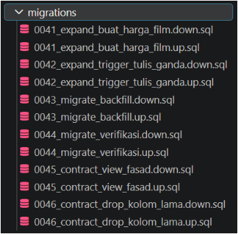

### Q6

**Pesan Galat Sebelum Refresh:**
```
ERROR: materialized view "ringkasan_akses" has not been populated
HINT: Use the REFRESH MATERIALIZED VIEW command.
```

**Durasi REFRESH biasa:**
```
Time: 494.398 ms
```

### Q7

**Pesan Galat Sebelum Refresh:**
```
ERROR: cannot refresh materialized view "lab4.ringkasan_akses" concurrently
HINT: Create a unique index with no WHERE clause on one or more columns of the materialized view.
```

**Durasi REFRESH CONCURRENTLY:**
```
Time: 572.396 ms
```

---

## Refleksi A–E

### Refleksi A (Jelita)

Menempatkan seluruh akses aplikasi lewat view memang punya beberapa keuntungan. Pertama, view bisa menyembunyikan struktur tabel asli dari aplikasi — kalau suatu saat skema tabel dasar berubah, aplikasi tidak perlu ikut berubah selama view-nya masih menyediakan kolom yang sama. Kedua, view mempermudah penerapan aturan akses, misalnya membatasi aplikasi hanya boleh melihat/mengubah data yang memenuhi kondisi tertentu (seperti `film_murah` yang membatasi `rental_rate <= 0.99`).

Tapi ada juga kerugiannya. Pertama, seperti yang terlihat di Q2, view tanpa `CHECK OPTION` bisa menyesatkan — aplikasi bisa saja berhasil insert data yang sebenarnya melanggar aturan bisnis, dan baru sadar ada masalah karena data "menghilang" dari tampilan, bukan karena ada pesan error yang jelas. Ini bisa bikin bug sulit dilacak. Kedua, seperti di Q4, tidak semua view bisa langsung dipakai untuk insert/update — view yang mengandung `GROUP BY` atau agregasi butuh trigger tambahan (`INSTEAD OF`) supaya bisa ditulisi, jadi tidak bisa diasumsikan semua view otomatis mendukung operasi tulis.

Contoh konkret dari pengamatan Q1–Q4: kasus di Q2 adalah yang paling berisiko kalau tidak disadari. Bayangkan aplikasi produksi memakai view `film_murah` sebagai satu-satunya jalur insert data film murah untuk promo. Tanpa `CHECK OPTION`, staff yang input harga salah (misalnya kelebihan ketik jadi 4.99 padahal maksudnya 0.99) tidak akan mendapat error apa pun — datanya tetap masuk ke database, tapi tidak pernah muncul di laporan promo karena difilter oleh view. Kesalahan data baru ketahuan belakangan, mungkin saat audit, dan sudah terlambat. Ini justru mempersulit tim karena kesalahan seperti ini "senyap" — tidak ada log, tidak ada error, tidak ada alert.

### Refleksi B (Mael)

*Trade-off* utama Materialized View terletak pada **kecepatan baca vs kebaruan data (*staleness*)**. Materialized View menyimpan hasil query agregasi secara fisik di disk sehingga pembacaan data jauh lebih cepat daripada menghitung ulang query dari awal. Namun, datanya bersifat statis (*stale*) dan tidak akan diperbarui secara otomatis ketika ada perubahan pada tabel sumber sampai perintah `REFRESH` dijalankan. Penggunaan `REFRESH` biasa memerlukan *Exclusive Lock* yang memblokir transaksi pembaca, sementara `REFRESH CONCURRENTLY` memungkinkan akses non-blocking bagi pembaca meski membutuhkan *Unique Index* serta waktu pemrosesan yang sedikit lebih lama (Q6: 494.398 ms vs Q7: 572.396 ms).

**Kompromi Konkret yang Diusulkan:**
1. **Batas Kebasian Data (*Staleness Limit*):** Menyepakati batas toleransi kebasian data maksimal 1 jam untuk laporan keuangan internal, dan menyediakan akses query langsung ke tabel utama jika laporan real-time benar-benar mendesak.
2. **Jadwal Refresh:** Menjalankan `REFRESH MATERIALIZED VIEW CONCURRENTLY` secara otomatis menggunakan penjadwal (*cron job* atau *pg_cron*) setiap 1 jam pada periode beban kerja rendah.
3. **Penanganan Kegagalan:** Menerapkan logika *retry* otomatis hingga 3 kali jika perintah refresh gagal. Bila kegagalan berlanjut, sistem akan memicu alarm notifikasi ke tim DB Admin sambil mempertahankan snapshot Materialized View versi terakhir agar aplikasi pembaca tidak terganggu.

### Refleksi C (Agi)

1. Kapan trigger per baris tetap lebih tepat walaupun lebih lambat?

Trigger per baris lebih tepat ketika setiap baris membutuhkan perlakuan atau logika yang berbeda.
Contohnya, jika setiap perubahan harga harus dihitung berdasarkan kondisi masing-masing film atau membutuhkan pemeriksaan nilai OLD dan NEW secara individual, FOR EACH ROW lebih sesuai.
Jadi walaupun biasanya lebih mahal untuk UPDATE massal, trigger per baris memberikan kontrol yang lebih detail terhadap setiap record.

2. Sebutkan satu kemampuan yang tidak dimiliki trigger pernyataan.

Trigger pernyataan tidak dapat secara langsung menjalankan fungsi satu kali untuk setiap baris.
Dengan:
FOR EACH STATEMENT
fungsi hanya dijalankan satu kali untuk seluruh perintah UPDATE.
Sebaliknya:
FOR EACH ROW
dapat mengakses:
OLD
NEW
untuk setiap baris secara individual.

3. Mengapa mengirim surel langsung dari trigger buruk ketika transaksi di-rollback?

Karena trigger berjalan sebagai bagian dari transaksi database.
Misalnya:

UPDATE
  ↓
Trigger mengirim email
  ↓
Transaksi gagal / ROLLBACK

Database akan membatalkan perubahan datanya, tetapi email yang sudah dikirim tidak ikut dibatalkan.
Akibatnya penerima bisa mendapatkan email yang mengatakan perubahan terjadi, padahal perubahan tersebut akhirnya tidak tersimpan di database.
Lebih aman jika trigger hanya mencatat event ke tabel/outbox, kemudian sistem lain mengirim email setelah transaksi berhasil COMMIT.


### Refleksi D (Azkha)

Jika aturan periode harga dibuat menggunakan trigger yang melakukan pengecekan sebelum INSERT, terdapat kemungkinan dua transaksi berjalan secara bersamaan. Misalnya transaksi A dan transaksi B sama-sama memeriksa tabel pada saat belum melihat data transaksi lainnya. Keduanya dapat menganggap periode yang akan dimasukkan masih tersedia, kemudian keduanya melakukan INSERT, sehingga periode yang seharusnya tidak boleh tumpang tindih akhirnya bisa masuk.

EXCLUDE lebih tepat untuk aturan ini karena PostgreSQL menegakkan larangan konflik sebagai constraint pada database, bukan hanya sebagai pemeriksaan biasa sebelum INSERT. Dengan demikian aturan overlap menjadi bagian dari mekanisme integritas data dan PostgreSQL dapat menangani konflik antar transaksi secara aman.

### Refleksi E (Syifa)

1. **Jarak Rilis yang Diusulkan:** 1 hingga 2 minggu (sesuai siklus *sprint* atau *soak period* di lingkungan produksi).
2. **Bukti yang Harus Dikumpulkan Sebelum Menjalankan 0046:**
  - **Log & Audit Akses Aplikasi:** Memastikan seluruh query dari aplikasi lama sudah dialihkan 100% menggunakan View Fasad (`v_film_fasad`) dan tidak ada lagi *service* atau query yang membaca langsung kolom `lab4.film.rental_rate`.
  - **Audit Konsistensi Data:** Nilai *count mismatch* antara tabel `lab4.film` dan `lab4.harga_film` konsisten bernilai **0** selama masa pemantauan (*monitoring period*).
  - **Backup/Snapshot Terverifikasi:** Adanya *backup database* yang valid dan telah diuji pemulihannya tepat sebelum `0046` dieksekusi. Hal ini penting karena skrip `.down.sql` pada `0046` hanya bisa membuat ulang struktur kolom `rental_rate`, tetapi **tidak dapat mengembalikan isi datanya secara otomatis**.

---

## Ringkasan Waktu

| Tugas |    Waktu   | Penafsiran                                                                                             |
| ----- | ---------: | ------------------------------------------------------------------------------------------------------ |
| Q5    | 441.836 ms | Query dasar membaca dan me-aggregate langsung 500.000 baris data dari tabel jejak_akses.               |
| Q6    | 494.398 ms | REFRESH memuat hasil agregasi ke dalam Materialized View dengan penguncian eksklusif (Exclusive Lock). |
| Q7    | 572.396 ms | REFRESH CONCURRENTLY membutuhkan waktu sedikit lebih lama karena PostgreSQL perlu membandingkan selisih data lama dan baru menggunakan indeks unik secara non-blocking.|
| Q12   |            |            |
| Q13   |            |            |

---

## Migrasi dan Commit

- **Struktur `migrations/`:** 

  Seluruh proses migrasi skema `lab4.film` ke `lab4.harga_film` diorganisir ke dalam 6 pasang file migrasi berversi (`.up.sql` dan `.down.sql`) pada folder `migrations/` mencakup fase *Expand*, *Migrate*, hingga *Contract*.
- **Tautan Merge Request:** _(diisi Jelita setelah semua branch digabung)_
- **Catatan sesi pembaca (Q8, Q20):**
  - **Q8 (Mael):** Berdasarkan pengujian dua sesi terminal terpisah, perintah `REFRESH MATERIALIZED VIEW` biasa mengambil *Exclusive Lock* yang memblokir query `SELECT` dari sesi pembaca hingga proses refresh selesai. Sebaliknya, `REFRESH MATERIALIZED VIEW CONCURRENTLY` memungkinkan sesi pembaca untuk tetap mengakses snapshot data lama secara instan tanpa tertahan (*non-blocking*) selagi proses perbaruan data berlangsung di latar belakang.
  - **Q20 (Syifa):** Pada fase *Contract*, View Fasad (`v_film_fasad`) diaktifkan untuk menjaga kompatibilitas aplikasi lama. Apabila sesi pembaca mengalami kegagalan (misalnya query error karena kolom `rental_rate` di tabel utama di-drop sebelum View Fasad siap), penyebab utamanya adalah **urutan eksekusi yang salah**—kolom lama dihapus sebelum pembaca dialihkan ke View Fasad. Urutan yang benar adalah: pasang View Fasad $\rightarrow$ alihkan aplikasi pembaca ke View $\rightarrow$ baru drop kolom lama (`rental_rate`).